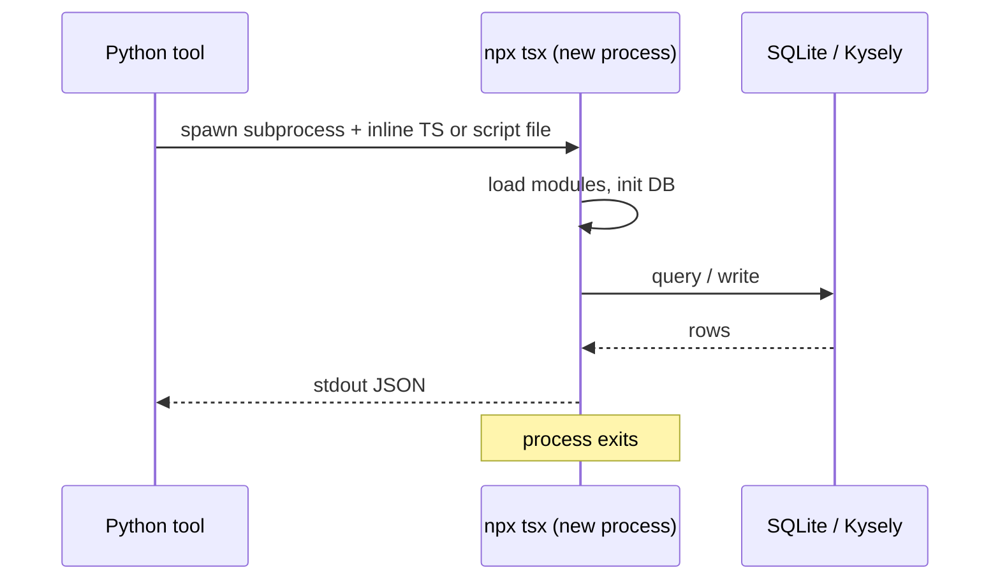
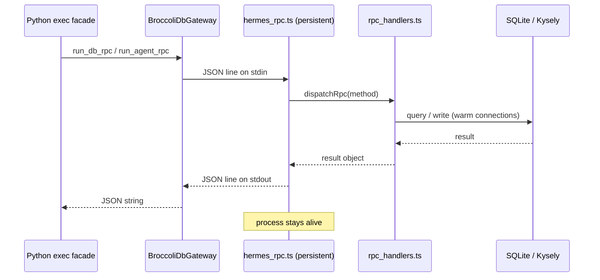
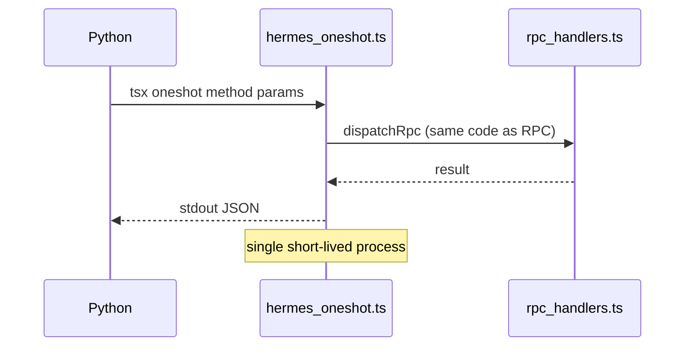

# BroccoliDB / BroccoliQ Native Execution & Throughput

This document describes the **Hermes native RPC execution layer** added to the Diet Hermes fork: how Python tools, the DietCode dashboard, and Kanban orchestration talk to BroccoliDB and BroccoliQ with higher throughput than the original “spawn `npx tsx` per call” design.

**Measured results (p50/p95, cold vs warm, batch):** [broccolidb-throughput-benchmark-results.md](./broccolidb-throughput-benchmark-results.md)  
**Fork doc index:** [README.md](./README.md) · **User overview:** [../README.md](../README.md#broccolidb--broccolidq)

**Audience:** developers extending tools, debugging dashboard latency, or profiling Kanban ↔ hive sync.

**Related code:**

| Area | Location |
|------|----------|
| Python facade | `plugins/dietcode/lib/tools/broccolidb_tools/exec.py` |
| Persistent worker gateway | `plugins/dietcode/lib/tools/broccolidb_tools/db_gateway.py` |
| Method registry | `plugins/dietcode/lib/tools/broccolidb_tools/db_native.py` |
| AgentContext RPC | `plugins/dietcode/lib/tools/broccolidb_tools/agent_rpc.py` |
| TS handlers (canonical) | `broccolidb/infrastructure/hermes/rpc_handlers.ts` |
| Persistent worker | `broccolidb/infrastructure/hermes/hermes_rpc.ts` |
| Cold one-shot dispatch | `broccolidb/infrastructure/hermes/hermes_oneshot.ts` |
| Persistent AgentContext | `broccolidb/infrastructure/hermes/agent_session.ts` |
| Benchmark harness | `scripts/benchmark_dietcode_throughput.py` |

---

## Executive summary

### Before

Every BroccoliDB/BroccoliQ operation from Python:

1. Spawned a **new** `npx tsx` subprocess.
2. Re-imported TypeScript modules and re-opened SQLite/Kysely.
3. For graph tools, bootstrapped a full **AgentContext** (Connection → Workspace → services) on **each** call.
4. Duplicated SQL/logic in inline Python-generated TS strings and separate CLI scripts.
5. Scanned full `queue_jobs` tables for status counts (row-by-row in JS).

**Typical cost per call (order of magnitude):** hundreds of milliseconds to several seconds of fixed overhead, dominated by process startup—not query time.

### After

1. **One persistent worker** (`hermes_rpc.ts`) keeps Config, Kysely, and optionally AgentContext warm.
2. **Newline-delimited JSON RPC** over stdin/stdout—one request, one response per line.
3. **Single implementation** of each operation in `rpc_handlers.ts` (CLI wrappers and RPC share the same functions).
4. **`batch`** RPC method for multiple operations in one round-trip.
5. **SQL `GROUP BY`** for queue metrics instead of full-table reads.
6. **`BufferedDbPool.flush()`** after hive sync writes.
7. **Unified cold fallback** via `hermes_oneshot.ts` when the worker is unavailable.

**Typical cost per warm call:** one JSON serialize + one SQLite round-trip (milliseconds to low tens of ms), plus steady-state process memory for the worker.

---

## Architecture: before vs after

### Before (per tool call)



### After (hot path)



### After (cold fallback)



---

## Throughput comparison by path

Qualitative comparison. **Hard numbers** (medians, p95, oneshot vs warm, batch): see [broccolidb-throughput-benchmark-results.md](./broccolidb-throughput-benchmark-results.md). Re-run with `scripts/benchmark_broccolidb_native_rpc.py` when `broccolidb.db` is live.

| Path | Before | After (warm RPC) | Primary win |
|------|--------|------------------|-------------|
| Dashboard `get_snapshot()` | New tsx + read script + full DB init + load all `queue_jobs` rows | One RPC `dashboard_snapshot`; pooled DB; `GROUP BY` queue counts | No per-poll process spawn; bounded SQL |
| `broccolidb_queue_status` | Inline tsx script per call | `run_db_rpc("queue_status")` | Persistent worker + aggregated SQL |
| `broccolidb_shard_status` | Inline tsx per call | `run_db_rpc("shard_status")` | Same |
| `broccolidb_hive_integrity` | Inline tsx per call | `run_db_rpc("hive_integrity")` | Same |
| Kanban `hive_sync` (per task event) | `npx tsx hive_sync.ts` + env payload | `run_db_rpc("hive_sync")` + `dbPool.flush()` | Amortized process; write-behind flush |
| Kanban `hive_drift` | Subprocess per drift check | RPC or batched with board intel | Fewer round-trips |
| `kanban_broccolidb_board_intel` | Kanban DB + **two** hive subprocesses | Kanban DB + **one** `run_db_rpc_batch` | 2→1 TS invocations |
| Graph `add_knowledge` / `query_graph` | Cold AgentContext per call | `run_agent_rpc` → persistent `agent_invoke` | ~1–3s bootstrap → ms-level RPC |
| `broccolidb_heal` | Cold AgentContext + large inline script | `run_agent_rpc("heal")` | Same |
| DietCode proposal approve/deny | Inline tsx + env vars | `run_db_rpc("proposal_action")` | Centralized handler |

### Order-of-magnitude overhead (typical developer laptop)

These are **not** guarantees—Node version, disk, and DB size dominate. Use them for planning only.

| Phase | Before (per call) | After (first call) | After (steady state) |
|-------|-------------------|--------------------|-----------------------|
| Process spawn (`npx tsx`) | 200–2000+ ms | 200–2000+ ms (worker start only) | ~0 ms (reuse worker) |
| Module load + DB init | 100–800 ms | Paid once at worker ready | ~0 ms |
| AgentContext bootstrap | 500–3000 ms | Optional preload once | ~0 ms |
| Actual SQL / logic | 1–100+ ms | 1–100+ ms | 1–100+ ms |
| **Typical total** | **~0.5–5 s** | **~0.3–3 s once** | **~5–80 ms** |

---

## What changed across five passes

### Pass 1 — Native RPC worker

- Introduced `broccolidb/infrastructure/hermes/hermes_rpc.ts` (persistent stdin/stdout worker).
- Introduced `plugins/dietcode/lib/tools/broccolidb_tools/db_gateway.py` (`BroccoliDbGateway`, `run_db_rpc`).
- Routed queue tools and DietCode dashboard snapshot to RPC.
- Extracted `snapshot_core.ts` for shared dashboard building.

### Pass 2 — Kanban + handlers centralization

- Moved hive sync/drift/board intel logic into `rpc_handlers.ts`.
- Thin CLI wrappers: `hive_sync.ts`, `hive_drift.ts`, `hive_board_intel.ts`.
- Kanban `run_hive_*` → `run_db_rpc` when RPC available.
- Ready handshake, local `node_modules/.bin/tsx`, idle worker recycle, `batch` RPC.

### Pass 3 — SQL aggregation + one-shot + warm

- `queue_metrics.ts`: `COUNT(*) … GROUP BY status` (no full-table scan).
- `hermes_oneshot.ts`: unified cold path for all RPC methods.
- `rpc_health` lightweight probe; `warm_db_rpc()` for dashboard.
- `kanban_broccolidb_board_intel`: `run_db_rpc_batch` for intel + drift.

### Pass 4 — Persistent AgentContext

- `agent_session.ts` + `agent_invoke.ts` (`agent_invoke` RPC).
- All `graph_tools.py` and kanban context/record → `run_agent_rpc`.
- `pool_flush` RPC; `flushDbPool()` after `hive_sync`.
- RPC version **4**.

### Pass 5 — Cold-path fixes + facade

- Fixed `_TS_CONTEXT` template: `HERMES_BROCCOLIDB_DB`, no private `ensureDb()`.
- `heal` op on native RPC; `broccolidb_heal` migrated.
- `plugins/dietcode/lib/tools/broccolidb_tools/exec.py` unified import surface.
- Worker optional `HERMES_BROCCOLIDB_PRELOAD_AGENT` for AgentContext warm on first request.
- One-shot path (`hermes_oneshot.ts`) forces `process.exit(0)` after emitting the JSON result to avoid event-loop hangs from pooled DB timers.

### Pass 6 — Production hardening + benchmarks

- **Lazy ready:** worker prints `{"ready":true}` before `getDb()`; schema self-heal runs on first RPC (Python first-call timeout extended).
- **Stdout hygiene:** redirect `console.log/info/debug` → stderr in `hermes_rpc.ts` and `hermes_oneshot.ts`; DbPool/schema logs use `console.warn`.
- **Python gateway:** skip non-JSON stdout lines when matching response `id`; `select`-based read timeouts; stderr drainer thread.
- **Oneshot:** `process.stdout.write` + `process.exit(0)` after result (no 120 s hang).
- **Benchmark harness:** `scripts/benchmark_broccolidb_native_rpc.py` (p50/p95, batch vs sequential).
- **Results doc:** [broccolidb-throughput-benchmark-results.md](./broccolidb-throughput-benchmark-results.md).

---

## RPC protocol

### Worker lifecycle

1. Python starts `tsx infrastructure/hermes/hermes_rpc.ts` (cwd = `broccolidb/` root).
2. Worker sets DB path from `HERMES_BROCCOLIDB_DB`.
3. Worker writes **one line** to stdout **immediately**:

   ```json
   {"ready":true,"rpc_version":4}
   ```

4. Python sends one JSON object per line on stdin; worker responds with one JSON line per request.
5. **Warmup is lazy** on the first request: the worker calls `getDb()` (and optionally preloads AgentContext if `HERMES_BROCCOLIDB_PRELOAD_AGENT=1`).

**Invariant:** stdout is reserved for the JSON-RPC line protocol. Any incidental logs must go to stderr (the worker redirects `console.log/info/debug` to stderr).

### Request / response

**Request:**

```json
{"id":1,"method":"dashboard_snapshot","params":{}}
```

**Success:**

```json
{"id":1,"ok":true,"result":{"success":true,"shard_id":"kanban",...}}
```

**Failure:**

```json
{"id":1,"ok":false,"error":"...","error_code":"RPC_ERROR"}
```

### RPC methods (`RPC_VERSION = 4`)

| Method | Purpose |
|--------|---------|
| `ping` | Trivial health |
| `rpc_health` | DB + shard probe without full snapshot |
| `dashboard_snapshot` | DietCode dashboard payload |
| `queue_status` | BroccoliQ job counts by status (all shards) |
| `shard_status` | Shard connectivity probe |
| `hive_integrity` | IntegrityWorker audit |
| `proposal_action` | Approve/deny healing proposals |
| `hive_sync` | Kanban → hive_tasks + optional queue_jobs |
| `hive_drift` | Compare kanban task IDs to hive rows |
| `hive_board_intel` | Bounded queue/hive metrics for orchestrator |
| `agent_invoke` | AgentContext ops (see below) |
| `pool_flush` | Flush BufferedDbPool write-behind buffer |
| `batch` | Run multiple methods in one request |

### `agent_invoke` operations

| `op` | Used by |
|------|---------|
| `warm` | Preload AgentContext in worker |
| `heal` | `broccolidb_heal` |
| `add_knowledge` | `broccolidb_add_knowledge`, kanban record |
| `query_graph` | `broccolidb_query_graph` |
| `get_task_context` | `broccolidb_get_task_context`, kanban context |
| `append_shared_memory` | `broccolidb_append_shared_memory` |
| `verify_sovereignty` | `broccolidb_verify_sovereignty` |

---

## Python API (recommended imports)

```python
from plugins.dietcode.lib.tools.broccolidb_tools.exec import (
    run_db_rpc,
    run_db_rpc_batch,
    run_agent_rpc,
    warm_db_rpc,
    rpc_available,
    RPC_VERSION,
    RPC_METHODS,
)
```

### Examples

```python
# Dashboard-style read
raw = run_db_rpc("dashboard_snapshot", timeout=45)

# Kanban hive write
raw = run_db_rpc("hive_sync", payload_dict, timeout=60)

# Graph write (persistent AgentContext when RPC up)
raw = run_agent_rpc("add_knowledge", {
    "kb_id": "auto",
    "type": "fact",
    "content": "API routes must validate auth.",
    "tags": "architecture,security",
})

# Multiple reads in one worker round-trip
raw = run_db_rpc_batch([
    ("hive_board_intel", {"shard_id": "kanban", "queue_limit": 500}),
    ("hive_drift", {"shard_id": "kanban", "task_ids": ["t_abc123"]}),
], timeout=60)

# Pre-warm before a poll loop (non-blocking)
warm_db_rpc()
# Or block until worker + optional AgentContext are ready
warm_db_rpc(block=True, preload_agent=True)
```

Lower-level modules remain available (`db_gateway`, `runner`, `agent_rpc`) but **`exec.py` is the supported surface**.

---

## Configuration & environment

### Environment variables

| Variable | Default | Effect |
|----------|---------|--------|
| `HERMES_BROCCOLIDB_RPC` | `1` | Set `0` / `false` to force cold `hermes_oneshot.ts` only |
| `HERMES_BROCCOLIDB_RPC_IDLE_SEC` | unset | Recycle worker after N seconds idle |
| `HERMES_BROCCOLIDB_PRELOAD_AGENT` | unset | Worker loads AgentContext at ready (also set by gateway when config requests it) |
| `HERMES_BROCCOLIDB_ROOT` | auto | BroccoliDB package root |
| `HERMES_BROCCOLIDB_DB` | auto | Path to `broccolidb.db` (profiles / kanban workspace aware) |

### `config.yaml` (DietCode dashboard)

```yaml
dietcode:
  dashboard:
    broccolidb_enabled: true
    poll_interval_seconds: 15
    warm_rpc: true                    # background warm on health check
    preload_agent_context: false      # true → HERMES_BROCCOLIDB_PRELOAD_AGENT on worker
```

### Kanban BroccoliDB (`kanban.broccolidb`)

Existing keys (`enabled`, `auto_sync`, `shard_id`, `sync_debounce_seconds`, …) unchanged. Hive writes automatically use RPC when `check_requirements()` passes (includes Hermes RPC modules).

---

## Measuring throughput locally

### Benchmark script

```bash
source .venv/bin/activate   # or: source venv/bin/activate
python scripts/benchmark_dietcode_throughput.py
python scripts/benchmark_dietcode_throughput.py --quick
python scripts/benchmark_dietcode_throughput.py -o /tmp/before.json
# ... make changes ...
python scripts/benchmark_dietcode_throughput.py -o /tmp/after.json
python scripts/benchmark_dietcode_throughput.py --compare /tmp/before.json /tmp/after.json
```

When `broccolidb.db` is live, the harness reports:

- `broccolidb get_health` — median ms (no subprocess when tree missing)
- `broccolidb get_snapshot (live, warm RPC)` — includes `rpc_health_median_ms` and snapshot min/median/max

### Suggested A/B procedure

1. **Cold baseline:** `HERMES_BROCCOLIDB_RPC=0`, run benchmark, save JSON.
2. **Warm RPC:** default env, run benchmark twice (first run pays worker start), save JSON.
3. Compare snapshot median and kanban sync latency under load (e.g. dispatcher ticking).

---

## Fallback & failure behavior

| Condition | Behavior |
|-----------|----------|
| `HERMES_BROCCOLIDB_RPC=0` | Every call uses `hermes_oneshot.ts` (still centralized handlers) |
| Missing `infrastructure/hermes/*.ts` | `rpc_available()` false → oneshot or kanban env scripts |
| Worker crash / timeout | Gateway retries once, then oneshot fallback |
| Worker fails ready (e.g. native module mismatch) | Logged warning; oneshot fallback |
| Invalid RPC method | JSON error `UNKNOWN_METHOD` |
| Non-JSON noise on stdout | Gateway skips until it sees the JSON line for the request id (stdout is reserved for protocol) |

### Node native module errors

If you see `NODE_MODULE_VERSION` / `better-sqlite3` ABI errors:

```bash
cd broccolidb && npm rebuild better-sqlite3
```

The gateway **does not** block the agent permanently—it falls back to one-shot dispatch when the worker cannot start.

---

## What remains on the cold path (intentional)

| Surface | Why |
|---------|-----|
| JoyZoning / SpiderEngine tools (`joyzoning_tools.py`, most of `structural_tools.py`) | No BroccoliDB hot read/write; structural analysis is filesystem/graph in SpiderEngine |
| `run_standalone_script` | Policy/audit scripts without AgentContext |
| `run_agent_context_script` | Escape hatch for one-off TS bodies not mapped to `agent_invoke` |
| BroccoliDB CLI (`npx broccolidb init/status/...`) | User-facing CLI, not agent hot path |

---

## File map (implementation)

```
broccolidb/infrastructure/
├── hermes/
│   ├── hermes_rpc.ts          # Persistent worker main
│   ├── hermes_oneshot.ts        # Cold: tsx oneshot <method> '<params-json>'
│   ├── rpc_handlers.ts          # Canonical dispatch + RPC_METHODS
│   ├── agent_session.ts         # Singleton AgentContext
│   ├── agent_invoke.ts          # agent_invoke op implementations
│   └── queue_metrics.ts         # GROUP BY queue status
├── dashboard/
│   ├── snapshot_core.ts         # buildDashboardSnapshot()
│   └── snapshot.ts              # CLI → snapshot_core
└── kanban/
    ├── hive_sync.ts             # CLI → runHiveSync
    ├── hive_drift.ts
    └── hive_board_intel.ts

plugins/dietcode/lib/tools/broccolidb_tools/
├── exec.py                      # ← preferred Python imports
├── db_gateway.py                # BroccoliDbGateway
├── db_native.py                 # RPC_VERSION, RPC_METHODS, warm_db_rpc
├── agent_rpc.py                 # run_agent_rpc
├── runner.py                    # resolve paths, legacy scripts, hive wrappers
├── graph_tools.py               # → run_agent_rpc
├── queue_tools.py               # → run_db_rpc
└── structural_tools.py          # heal → run_agent_rpc; rest standalone

hermes_cli/dietcode_broccolidb.py  # Dashboard bridge → run_db_rpc
plugins/dietcode/lib/tools/kanban_broccolidb_bridge.py  # → run_hive_sync / drift
plugins/dietcode/lib/tools/kanban_broccolidb_tools.py   # batch intel + agent_rpc
```

---

## Keeping Python and TypeScript in sync

When adding a new RPC method:

1. Implement handler in `rpc_handlers.ts` and add to `RPC_METHODS` array.
2. Add the same name to `plugins/dietcode/lib/tools/broccolidb_tools/db_native.py` → `RPC_METHODS`.
3. Bump `RPC_VERSION` in **both** files.
4. Extend `check_requirements()` if new files are required.
5. Add a contract test in `tests/tools/test_broccolidb_exec_facade.py` (behavior, not snapshot of DB contents).

---

## Tests

```bash
scripts/run_tests.sh tests/tools/test_broccolidb_db_gateway.py
scripts/run_tests.sh tests/tools/test_broccolidb_exec_facade.py
scripts/run_tests.sh tests/hermes_cli/test_dietcode_broccolidb_api.py
scripts/run_tests.sh tests/tools/test_kanban_broccolidb_tools.py
```

---

## Summary

| Dimension | Before | After |
|-----------|--------|-------|
| **Processes per hot call** | 1 new `npx tsx` | 0 (reuse worker) or 1 oneshot on fallback |
| **Implementation copies** | Many inline TS strings + scripts | One `rpc_handlers.ts` |
| **AgentContext** | Cold bootstrap per graph call | Persistent in worker |
| **Queue metrics SQL** | Full table scan | `GROUP BY` aggregation |
| **Kanban board intel** | 2 subprocesses | 1 batched RPC (when task IDs known) |
| **Write durability** | Direct Kysely only | Kysely + `dbPool.flush()` after hive sync |
| **Discoverability** | Scattered `runner` imports | `plugins.dietcode.lib.tools.broccolidb_tools.exec` |

The design goal is simple: **pay startup once, pay SQL many times**—with a safe, centralized cold path when the worker cannot run.
