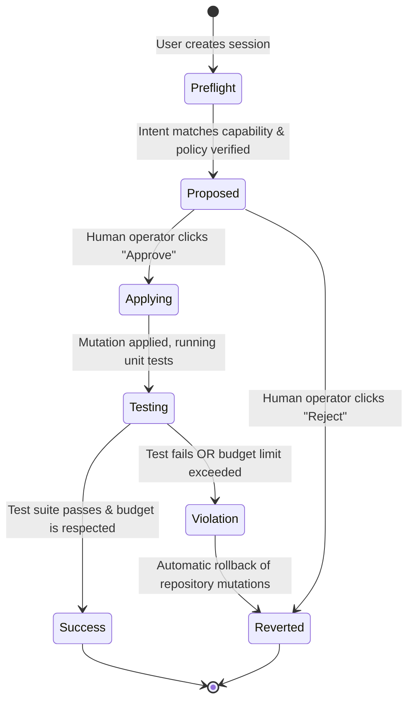

# Bounded Transaction Operational Flows 🔄

This page describes the lifecycle of an operator mutation session from initial user intent to completed deployment or automated safety rollback.

## Session State Transitions

The lifecycle transitions through well-defined transactional phases:

---

## The 5 Transactional Phases

### 1. Intent Received (`preflight`)
* **Trigger:** Client posts a description of the task via `POST /sessions`.
* **Action:** The Control Plane initializes the Firestore session document with `status = "preflight"`, logs the intent received event, and enqueues the `preflight` phase worker container task.

### 2. Policy Verified & Signed (`preflight` completion)
* **Trigger:** Ephemeral worker starts the `preflight` phase.
* **Action:** The worker checks that the user's intent is within the boundaries specified by their Capability Profile (e.g. max file size, file types, banned bash commands). 
* **Outcome:** If valid, the worker signs the session proposal by generating a SHA-256 hash.

### 3. Patch Proposed (`proposed`)
* **Trigger:** Preflight worker completes.
* **Action:** The worker saves the code modification diff (`proposal.diff`) to GCS and transitions the Firestore document to `status = "proposed"`. The session pauses, avoiding idle worker container costs, waiting for human intervention.

### 4. Approval Granted & Wakeup (`applying`)
* **Trigger:** Developer reviews the diff in the DietCode Dashboard and clicks "Approve".
* **Action:** The Control Plane updates Firestore to `status = "applying"` and immediately enqueues the Cloud Task wake-up request to start the `apply` phase container worker.

### 5. Works in Sandbox (`testing` -> `success` / `violation`)
* **Trigger:** Ephemeral worker starts the `apply` phase.
* **Action:**
  1. The worker pulls the workspace snapshot and `proposal.diff` from GCS.
  2. Verifies cryptographic diff signatures match Firestore policy bounds.
  3. Applies the patch to the workspace.
  4. Runs the project unit tests.
* **Outcome:**
  * **Success:** If tests pass and budget usage is within bounds, the worker saves the final `post-test.tar.gz` archive, updates status to `success`, and exits.
  * **Violation & Rollback:** If tests fail or any budget boundary (e.g. file counts, runtime limits) is crossed, the worker logs the violation event to `/events`, reverts the workspace changes, transitions status to `violation`, and aborts.
